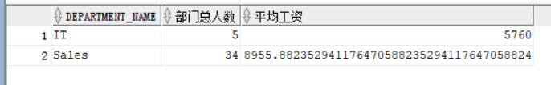
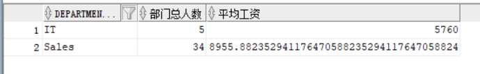

#实验一
- 查询一
```sql
SELECT d.department_name，count(e.job_id)as "部门总人数"，
avg(e.salary)as "平均工资"
from hr.departments d，hr.employees e
where d.department_id = e.department_id
and d.department_name in ('IT'，'Sales')
GROUP BY department_name;
```

#####有优化建议：
#####可以创建索引来优化此语句的查询速度

- 查询二
```sql
SELECT d.department_name，count(e.job_id)as "部门总人数"，
avg(e.salary)as "平均工资"
FROM hr.departments d，hr.employees e
WHERE d.department_id = e.department_id
GROUP BY department_name
HAVING d.department_name in ('IT'，'Sales');
```

#####无优化建议

- 自行设计语句
```sql
SELECT d.department_name，count(e.job_id)as "部门总人数"，
avg(e.salary)as "平均工资"
FROM hr.departments d，hr.employees e
WHERE d.department_id = e.department_id
and d.department_name = 'IT' or d.department_name = 'Sales'
GROUP BY department_name
```
#####在进行连接的时候会造成开销很大的笛卡尔积操作，可以进一步优化。

