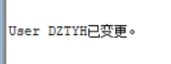
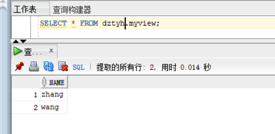

# 实验二

## oracle用户名：dztyh

## 用户创建及角色创建
- 创建角色

```sql
CREATE ROLE dztyh_role;
```


```sql
 GRANT connect,resource,CREATE VIEW TO dztyh_role;
```


- 创建用户

```sql
CREATE USER dztyh IDENTIFIED BY 123 DEFAULT TABLESPACE users TEMPORARY TABLESPACE temp;
```


## 分配表空间及角色

- 分配表空间

```sql
ALTER USER dztyh QUOTA 50M ON users;
```



- 分配角色

```sql
 GRANT dztyh_role TO dztyh;
```


## 创建表并分享给其他用户进行查询

- 创建表和视图并插入数据
```sql
show user;
CREATE TABLE mytable (id number,name varchar(50));
INSERT INTO mytable(id,name)VALUES(1,'zhang');
INSERT INTO mytable(id,name)VALUES (2,'wang');
CREATE VIEW myview AS SELECT name FROM mytable;
```


- 授权其他用户
```sql
SELECT * FROM myview;
```


- 其他用户查询

