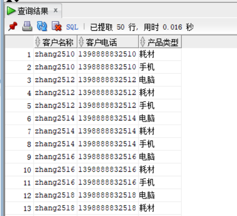

# 实验四
## 用户名：dztyh

#### 1.创建表和分区并插入数据
```sql
declare
  dt date;
  m number(8,2);
  V_EMPLOYEE_ID NUMBER(6);
  v_order_id number(10);
  v_name varchar2(100);
  v_tel varchar2(100);
  v number(10,2);
begin
  for i in 1..10000
  loop
    if i mod 2 =0 then
      dt:=to_date('2015-3-2','yyyy-mm-dd')+(i mod 60);
    else
      dt:=to_date('2016-3-2','yyyy-mm-dd')+(i mod 60);
    end if;
    V_EMPLOYEE_ID:=CASE I MOD 6 WHEN 0 THEN 11 WHEN 1 THEN 111 WHEN 2 THEN 112
                                WHEN 3 THEN 12 WHEN 4 THEN 121 ELSE 122 END;
    v_order_id:=SEQ_ORDER_ID.nextval;
    v_name := 'aa'|| 'aa';
    v_name := 'zhang' || i;
    v_tel := '139888883' || i;
    insert /*+append*/ into ORDERS (ORDER_ID,CUSTOMER_NAME,CUSTOMER_TEL,ORDER_DATE,EMPLOYEE_ID,DISCOUNT)
      values (v_order_id,v_name,v_tel,dt,V_EMPLOYEE_ID,dbms_random.value(100,0));
    v:=dbms_random.value(10000,4000);
    v_name:='computer'|| (i mod 3 + 1);
    insert /*+append*/ into ORDER_DETAILS(ID,ORDER_ID,PRODUCT_NAME,PRODUCT_NUM,PRODUCT_PRICE)
      values (SEQ_ORDER_DETAILS_ID.NEXTVAL,v_order_id,v_name,2,v);
    v:=dbms_random.value(1000,50);
    v_name:='paper'|| (i mod 3 + 1);
    insert /*+append*/ into ORDER_DETAILS(ID,ORDER_ID,PRODUCT_NAME,PRODUCT_NUM,PRODUCT_PRICE)
      values (SEQ_ORDER_DETAILS_ID.NEXTVAL,v_order_id,v_name,3,v);
    v:=dbms_random.value(9000,2000);
    v_name:='phone'|| (i mod 3 + 1);
    insert /*+append*/ into ORDER_DETAILS(ID,ORDER_ID,PRODUCT_NAME,PRODUCT_NUM,PRODUCT_PRICE)
      values (SEQ_ORDER_DETAILS_ID.NEXTVAL,v_order_id,v_name,1,v);
    select sum(PRODUCT_NUM*PRODUCT_PRICE) into m from ORDER_DETAILS where ORDER_ID=v_order_id;
    if m is null then
     m:=0;
    end if;
    UPDATE ORDERS SET TRADE_RECEIVABLE = m - discount WHERE ORDER_ID=v_order_id;
    IF I MOD 1000 =0 THEN
      commit;
    END IF;
  end loop;
```
##### 执行结果：


#### 2.查询某个员工的信息
```sql
select * from EMPLOYEES where  EMPLOYEE_ID=11;
```
##### 执行结果：


#### 3.递归查询某个员工及其所有下属，子下属员工。
```sql
WITH A (EMPLOYEE_ID,NAME,EMAIL,PHONE_NUMBER,HIRE_DATE,SALARY,MANAGER_ID,DEPARTMENT_ID) AS
(SELECT EMPLOYEE_ID,NAME,EMAIL,PHONE_NUMBER,HIRE_DATE,SALARY,MANAGER_ID,DEPARTMENT_ID
FROM EMPLOYEES WHERE employee_ID = 1
UNION ALL
SELECT B.EMPLOYEE_ID,B.NAME,B.EMAIL,B.PHONE_NUMBER,B.HIRE_DATE,B.SALARY,B.MANAGER_ID,B.DEPARTMENT_ID
FROM A, EMPLOYEES B WHERE A.EMPLOYEE_ID = B.MANAGER_ID)
SELECT * FROM A;
```
##### 执行结果：


#### 4.查询订单表，并且包括订单的订单应收货款: `Trade_Receivable= sum(订单详单表.ProductNum*订单详单表.ProductPrice)- Discount`。
```sql
SELECT
order_id,
pay-discount as Trade_Receivable
from
    (select
        orders.order_id as order_id,
        ORDERS.DISCOUNT as discount,
        sum(PRODUCT_NUM*PRODUCT_PRICE) as pay
        from ORDER_DETAILS 
        inner join ORDERS on(orders.order_id=order_details.order_id) 
        group by orders.order_id, ORDERS.DISCOUNT
);
```
##### 执行结果：


#### 5.查询订单详表，要求显示订单的客户名称和客户电话，产品类型用汉字描述。
```sql
select CUSTOMER_NAME as "客户名称",CUSTOMER_TEL as "客户电话",PRODUCT_TYPE as "产品类型"
from ORDERS o,PRODUCTS p,ORDER_DETAILS d
where o.ORDER_ID=d.ORDER_ID 
and d.PRODUCT_NAME=p.PRODUCT_NAME;
```
##### 执行结果：


#### 6.查询出所有空订单，即没有订单详单的订单。
```sql
select distinct         
ORDERS.ORDER_ID,ORDERS.CUSTOMER_NAME,
ORDERS.CUSTOMER_TEL,ORDERS.ORDER_DATE,
ORDERS.EMPLOYEE_ID,ORDERS.DISCOUNT,ORDERS.TRADE_RECEIVABLE 
from ORDERS where ORDERS.ORDER_ID not in (select ORDER_ID from ORDER_DETAILS);
```
##### 执行结果：


#### 7.查询部门表，同时显示部门的负责人姓名。
```sql
select DEPARTMENT_NAME as "部门",MANAGER_ID as "部门负责人" 
from DEPARTMENTS d,EMPLOYEES e
where d.DEPARTMENT_ID=e.DEPARTMENT_ID;
```
##### 执行结果：


####8.查询部门表，统计每个部门的销售总金额。
```sql
select DEPARTMENT_NAME,SUM(o.Trade_Receivable)AS "销售总金额"
from DEPARTMENTS d,EMPLOYEES e,ORDERS o
where d.DEPARTMENT_ID=e.DEPARTMENT_ID and e.EMPLOYEE_ID=o.EMPLOYEE_ID group by DEPARTMENT_NAME;
```
##### 执行结果：
